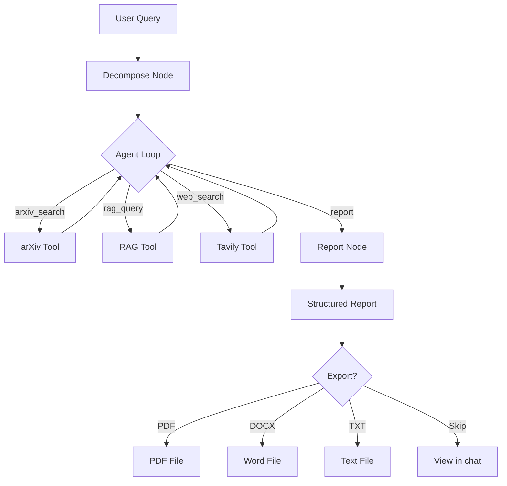

# 🔬 AI Research Agent

> Autonomous academic research assistant with easy use: input a question and output a structured report with citations.

[](https://huggingface.co/spaces/YOUR_USERNAME/ai-research-agent)
[](https://www.python.org/)
[](https://github.com/langchain-ai/langgraph)
[](https://streamlit.io)

## Demo


<!-- Record a short screen capture of a full research run and save it as assets/demo.gif -->

---

## What it does

Enter a research question. The agent will:

1. Break your question into a few sub-queries
2. Search arXiv for relevant academic papers
3. Download and index PDFs into a local vector database
4. Use a RAG pipeline to retrieve relevant information
5. Generate a structured report with citations (the report structure can be customized in config/prompts.py)
6. Export the report as **PDF**, **DOCX**, or **TXT** (optional)

---

## Architecture



**Core loop:** Agent runs (Reason → Act → Observe) by LangGraph.
At each step, the LLM selects the next tool to use and continues until it has enough data to generate the final report.
---

## Quick Start

```bash
# 1. Clone the project
git clone https://github.com/YOUR_USERNAME/research-agent.git
cd research-agent

# 2. Create virtual environment
python -m venv .venv
source .venv/bin/activate        # Mac / Linux
# .venv\Scripts\activate         # Windows

# 3. Install dependencies
pip install -r requirements.txt

# 4. Edit .env and fill in OPENAI_API_KEY and TAVILY_API_KEY
cp .env.example .env

# 5. Run
streamlit run app.py
```

Open `http://localhost:8501` in your browser.

---

## Project Structure

```
research-agent/
├── app.py                  # Streamlit UI
├── main.py                 # CLI entry point (testing agent without UI)
├── agents/
│   ├── graph.py            # LangGraph workflow 
│   ├── nodes.py            # node functions
│   └── state.py            # Shared state 
├── tools/
│   ├── arxiv_tool.py       # arXiv search + PDF download
│   ├── rag_tool.py         # RAG query tool (empty for now)
│   ├── search.py           # Tavily web search
│   └── export.py           # PDF / DOCX / TXT export
├── rag/
│   ├── pipeline.py         # ChromaDB ingestion pipeline
│   ├── chunker.py          # Recursive text chunker
│   └── retriever.py        # Similarity search
├── config/
│   ├── settings.py         # global variables and model config
│   └── prompts.py          # System and task prompts
└── tests/
    ├── test_agent.py
    ├── test_export.py  
    ├── test_rag.py  
    └── test_tools.py  
```
---

## Tech Stack

| Component | Choice | 
|----------|--------|
| Agent | LangGraph 0.2+ | 
| LLM | GPT-4o-mini | 
| Embeddings | text-embedding-3-small |                                    
| Vector database | ChromaDB | 
| PDF parsing | PyMuPDF | 
| Web search | Tavily | 
| UI | Streamlit | 
| Export | python-docx + reportlab | 
---

## Running Tests

```bash
# Fast tests — no API calls, runs in seconds
pytest tests/test_rag.py::test_chunker -v
pytest tests/test_export.py -v

# Full integration test — calls OpenAI API, costs ~$0.01
pytest tests/test_agent.py -v -s
```

---

## License

MIT